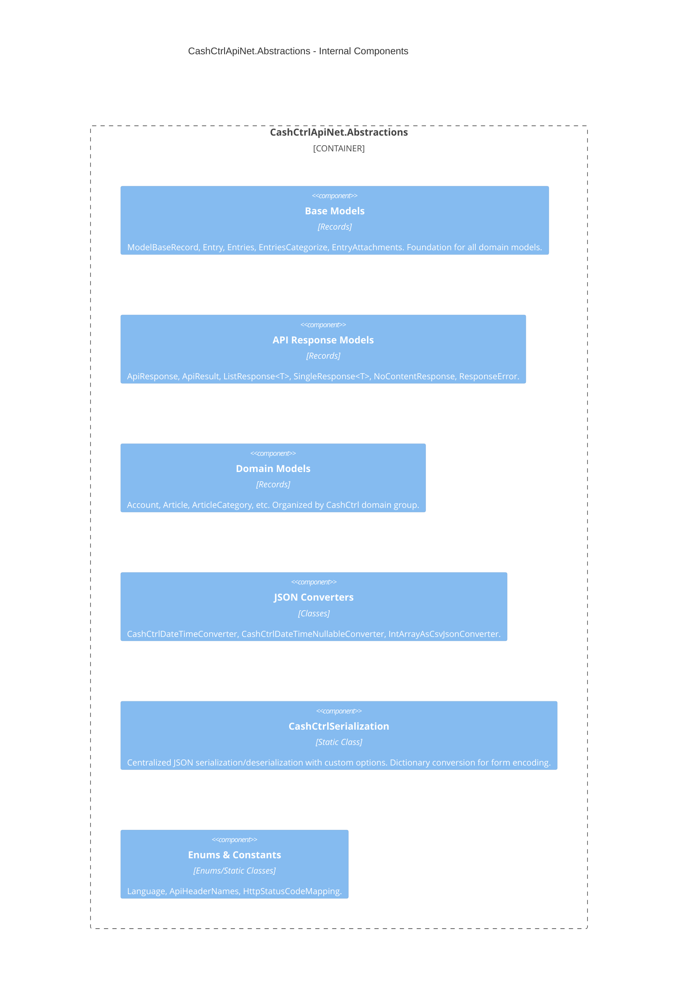

# CashCtrlApiNet.Abstractions -- Component Diagram



## Component Details

### Base Models (`Models/Base/`)

| Type                | File                    | Purpose                                                   |
| ------------------- | ----------------------- | --------------------------------------------------------- |
| `ModelBaseRecord`   | `ModelBaseRecord.cs`    | Abstract base for all domain models. Enforces record type. |
| `Entry`             | `Entry.cs`              | Single entry ID (`int Id`). Used for read operations.      |
| `Entries`           | `Entries.cs`            | Multiple entry IDs (`ImmutableArray<int> Ids`). Used for delete and batch operations. CSV-serialized via `IntArrayAsCsvJsonConverter`. |
| `EntriesCategorize` | `EntriesCategorize.cs`  | Extends `Entries` with `int TargetCategoryId`. Used for categorize operations. |
| `EntryAttachments`  | `EntryAttachments.cs`   | Extends `Entry` with `ImmutableArray<int>? AttachedFileIds`. Used for attachment updates. |

### API Response Models (`Models/Api/`)

| Type                   | File                     | Purpose                                                   |
| ---------------------- | ------------------------ | --------------------------------------------------------- |
| `ApiResponse`          | `Base/ApiResponse.cs`    | Abstract base record for all API response payloads.        |
| `ApiResult`            | `ApiResult.cs`           | Wraps HTTP metadata: `IsHttpSuccess`, `HttpStatusCode`, `CashCtrlHttpStatusCodeDescription`, `RequestsLeft`. |
| `ApiResult<T>`         | `ApiResult.cs`           | Extends `ApiResult` with `T? ResponseData` where T : `ApiResponse`. |
| `ListResponse<T>`      | `ListResponse.cs`        | Response for list endpoints: `Total`, `ImmutableArray<T> Data`, `Summary`, `Properties`. |
| `SingleResponse<T>`    | `SingleResponse.cs`      | Response for read endpoints: `Success`, `ErrorMessage`, `T? Data`. |
| `NoContentResponse`    | `NoContentResponse.cs`   | Response for create/update/delete: `Success`, `Errors`, `Message`, `InsertId`. |
| `ResponseError`        | `ResponseError.cs`       | Validation error: `Field`, `Message`.                      |

### Domain Models (`Models/{Group}/`)

**Implemented with full properties:**

- `Models/Inventory/Article/` -- `ArticleCreate` -> `ArticleUpdate` -> `ArticleListed` -> `Article` (inheritance chain), plus `ArticleAttachment`
- `Models/Inventory/ArticleCategory/` -- `ArticleCategoryCreate` -> `ArticleCategoryUpdate` -> `ArticleCategory`, plus `ArticleCategoryAllocation`

**Stubs (no properties, marked with `// TODO: implement members`):**

- `Models/Account/` -- `Account`, `AccountCreate`, `AccountUpdate`

**Not yet created (empty folder placeholders in .csproj):**

- `Models/Common/`, `Models/File/`, `Models/Journal/`, `Models/Meta/`, `Models/Order/`, `Models/Person/`, `Models/Report/`

### Model Inheritance Pattern

Each domain entity follows a three-tier inheritance chain:

```
ModelBaseRecord
  -> XxxCreate    (fields for creating a new entity -- all optional except Name)
    -> XxxUpdate  (adds required Id for updating an existing entity)
      -> XxxListed / Xxx  (adds server-generated read-only fields: Created, CreatedBy, etc.)
```

This allows:
- `Create` operations to accept `XxxCreate` (no Id)
- `Update` operations to accept `XxxUpdate` (with Id, inherits all Create fields)
- `Get`/`List` operations to return `Xxx`/`XxxListed` (full entity with audit fields)
- Record `with` expressions to cast down for update operations

### JSON Converters (`Converters/`)

| Converter                          | Purpose                                                        |
| ---------------------------------- | -------------------------------------------------------------- |
| `CashCtrlDateTimeConverter`        | Converts `DateTime` to/from `"yyyy-MM-dd HH:mm:ss.f"` format  |
| `CashCtrlDateTimeNullableConverter`| Same for `DateTime?`                                           |
| `IntArrayAsCsvJsonConverter`       | Converts `ImmutableArray<int>` to/from comma-separated strings |

### CashCtrlSerialization (`Helpers/CashCtrlSerialization.cs`)

Centralized serialization with a singleton `JsonSerializerOptions` instance configured with:
- `DefaultIgnoreCondition = WhenWritingNull`
- `DictionaryKeyPolicy = CamelCase`
- Custom DateTime converters

**Key methods:**
- `Deserialize<T>(json)` -- Parse JSON string to typed object
- `Serialize<T>(data)` -- Serialize object to JSON string (uses default options, no custom converters)
- `ConvertToDictionary<T>(data)` -- Serialize to JSON then deserialize as `Dictionary<string, string?>`. Used by `CashCtrlConnectionHandler` for form-encoded POST bodies and query parameters.

### Enums and Constants

| Type                  | File                      | Purpose                                              |
| --------------------- | ------------------------- | ---------------------------------------------------- |
| `Language`            | `Enums/Api/Language.cs`   | Enum: `de`, `fr`, `it`, `en`                         |
| `ApiHeaderNames`      | `Enums/Api/ApiHeaderNames.cs` | Constant: `"X-CashCtrl-Requests-Left"`           |
| `HttpStatusCodeMapping` | `Values/HttpStatusCodeMapping.cs` | Maps HTTP status codes to CashCtrl-specific descriptions |
