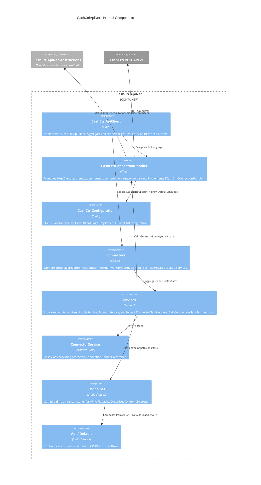

# CashCtrlApiNet -- Component Diagram



## Component Details

### CashCtrlApiClient

- **File:** `src/CashCtrlApiNet/Services/CashCtrlApiClient.cs`
- **Interface:** `ICashCtrlApiClient` (`src/CashCtrlApiNet/Interfaces/ICashCtrlApiClient.cs`)
- **Responsibility:** Top-level facade. Holds references to all 9 connector groups (Account, Common, File, Inventory, Journal, Meta, Order, Person, Report). All dependencies injected via constructor.
- **Key method:** `SetLanguage(Language)` -- delegates to `ICashCtrlConnectionHandler`.

### CashCtrlConnectionHandler

- **File:** `src/CashCtrlApiNet/Services/CashCtrlConnectionHandler.cs`
- **Interface:** `ICashCtrlConnectionHandler` (`src/CashCtrlApiNet/Interfaces/ICashCtrlConnectionHandler.cs`)
- **Responsibility:** Creates and manages `HttpClient`. Handles authentication (Basic Auth), request construction (query params, form-encoded body), response parsing (status codes, headers, JSON deserialization).
- **Key methods:**
  - `GetAsync(requestPath)` / `GetAsync<TResult>(...)` -- GET requests
  - `GetAsync<TResult, TQuery>(requestPath, queryParams)` -- GET with query parameters
  - `PostAsync<TResult, TPost>(requestPath, payload)` -- POST with form-encoded body
- **Private helpers:**
  - `GetHttpRequestMessage` -- Constructs URI with language query param
  - `GetHttpRequestMessageWithFormData` -- Adds `FormUrlEncodedContent` via `CashCtrlSerialization.ConvertToDictionary`
  - `GetApiResult` / `GetApiResult<T>` -- Extracts status, headers, deserializes JSON

### CashCtrlConfiguration

- **File:** `src/CashCtrlApiNet/Services/CashCtrlConfiguration.cs`
- **Interface:** `ICashCtrlConfiguration` (`src/CashCtrlApiNet/Interfaces/ICashCtrlConfiguration.cs`)
- **Responsibility:** Simple POCO holding `BaseUri`, `ApiKey`, `DefaultLanguage`. Uses `required init` properties.

### Connectors (Domain Group Aggregators)

- **Location:** `src/CashCtrlApiNet/Services/Connectors/{Group}Connector.cs`
- **Pattern:** Each connector implements an `I{Group}Connector` interface, instantiates its child services in the constructor using the shared `ICashCtrlConnectionHandler`, and exposes them as read-only properties.
- **Example:** `InventoryConnector` exposes `IArticleService Article`, `IArticleCategoryService ArticleCategory`, etc.
- **Note:** Many connectors have commented-out service instantiations (not yet implemented).

### Services (Entity-Level API Callers)

- **Location:** `src/CashCtrlApiNet/Services/Connectors/{Group}/{Entity}Service.cs`
- **Pattern:** Each service class uses a primary constructor inheriting from `ConnectorService`, implements an `I{Entity}Service` interface, and provides CRUD methods that delegate to `ConnectionHandler.GetAsync/PostAsync` with the appropriate `Endpoint` constant.
- **Example:** `ArticleService.Get(Entry articleId)` calls `ConnectionHandler.GetAsync<SingleResponse<Article>, Entry>(Endpoint.Read, articleId)`.

### Endpoints (URL Path Constants)

- **Location:** `src/CashCtrlApiNet/Services/Endpoints/{Group}Endpoints.cs`
- **Base classes:** `Api` (defines `V1 = "api/v1"`), `Default` (defines `Read`, `List`, `Create`, `Update`, `Delete` suffixes).
- **Pattern:** Nested static classes. E.g., `InventoryEndpoints.Article.Read` = `"api/v1/inventory/article/read.json"`.
- **Service classes import endpoints** via `using Endpoint = InventoryEndpoints.Article;`.

## Request Flow (Example: Get Article)

```
Consumer calls: client.Inventory.Article.Get(new Entry { Id = 42 })
  -> ArticleService.Get(entry)
  -> ConnectionHandler.GetAsync<SingleResponse<Article>, Entry>("api/v1/inventory/article/read.json", entry)
  -> GetHttpRequestMessage(GET, path, entry as query params)
       -> CashCtrlSerialization.ConvertToDictionary(entry) -> { "id": "42" }
       -> Builds URI: https://org.cashctrl.com/api/v1/inventory/article/read.json?lang=de&id=42
  -> HttpClient.SendAsync(request)
  -> GetApiResult<SingleResponse<Article>>(response)
       -> ReadAsStringAsync() -> JSON string
       -> CashCtrlSerialization.Deserialize<SingleResponse<Article>>(json)
       -> Extract headers (X-CashCtrl-Requests-Left)
       -> Return ApiResult<SingleResponse<Article>>
```
