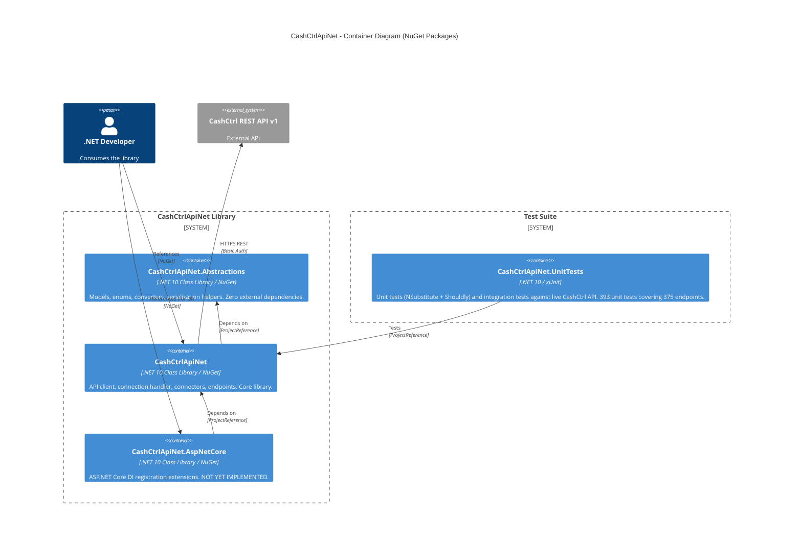

# Container Diagram

## Package Details

### CashCtrlApiNet.Abstractions

| Property        | Value                                              |
| --------------- | -------------------------------------------------- |
| Technology      | .NET 10 Class Library                               |
| NuGet Package   | `CashCtrlApiNet.Abstractions`                      |
| Repo Path       | `src/CashCtrlApiNet.Abstractions/`                 |
| Responsibility  | Domain models, API response types, enums, JSON converters, serialization helpers |
| Dependencies    | None (only `System.Text.Json` from framework)       |
| Interfaces      | No service interfaces -- only data types            |

**Key directories:**
- `Models/Base/` -- `ModelBaseRecord`, `Entry`, `Entries`, `EntriesCategorize`, `EntryAttachments`
- `Models/Api/` -- `ApiResult`, `ApiResponse`, `ListResponse<T>`, `SingleResponse<T>`, `NoContentResponse`, `ResponseError`
- `Models/{Group}/{Entity}/` -- Domain models for all 10 groups (Account, Common, File, Inventory, Journal, Meta, Order, Person, Report, Salary)
- `Converters/` -- `CashCtrlDateTimeConverter`, `CashCtrlDateTimeNullableConverter`, `IntArrayAsCsvJsonConverter`
- `Helpers/` -- `CashCtrlSerialization` (JSON serialize/deserialize, dictionary conversion)
- `Enums/Api/` -- `Language`, `ApiHeaderNames`
- `Values/` -- `HttpStatusCodeMapping`

### CashCtrlApiNet

| Property        | Value                                              |
| --------------- | -------------------------------------------------- |
| Technology      | .NET 10 Class Library                               |
| NuGet Package   | `CashCtrlApiNet`                                   |
| Repo Path       | `src/CashCtrlApiNet/`                              |
| Responsibility  | HTTP client, API connection handling, typed service interfaces, connector aggregation, endpoint path definitions |
| Dependencies    | `CashCtrlApiNet.Abstractions`                      |
| Key Interface   | `ICashCtrlApiClient` -- entry point for consumers  |

**Key directories:**
- `Interfaces/` -- `ICashCtrlApiClient`, `ICashCtrlConfiguration`, `ICashCtrlConnectionHandler`
- `Interfaces/Connectors/` -- Connector group interfaces (e.g., `IInventoryConnector`)
- `Interfaces/Connectors/{Group}/` -- Individual service interfaces (e.g., `IArticleService`)
- `Services/` -- `CashCtrlApiClient`, `CashCtrlConfiguration`, `CashCtrlConnectionHandler`
- `Services/Connectors/` -- Connector implementations (e.g., `InventoryConnector`)
- `Services/Connectors/{Group}/` -- Service implementations (e.g., `ArticleService`)
- `Services/Connectors/Base/` -- `ConnectorService` abstract base class
- `Services/Endpoints/` -- Static endpoint path constants (e.g., `InventoryEndpoints`)
- `Services/Endpoints/Base/` -- `Api` (version root), `Default` (CRUD action suffixes)

### CashCtrlApiNet.AspNetCore

| Property        | Value                                              |
| --------------- | -------------------------------------------------- |
| Technology      | .NET 10 Class Library                               |
| NuGet Package   | `CashCtrlApiNet.AspNetCore`                        |
| Repo Path       | `src/CashCtrlApiNet.AspNetCore/`                   |
| Responsibility  | Dependency injection registration for ASP.NET Core |
| Dependencies    | `CashCtrlApiNet`                                   |
| Status          | **EMPTY** -- only `.csproj` exists, no C# code     |

### CashCtrlApiNet.UnitTests

| Property        | Value                                              |
| --------------- | -------------------------------------------------- |
| Technology      | .NET 10, xUnit, NSubstitute, Shouldly, FluentAssertions, Coverlet |
| Repo Path       | `tests/CashCtrlApiNet.UnitTests/`                      |
| Responsibility  | Integration tests against live CashCtrl API        |
| Dependencies    | `CashCtrlApiNet` (transitively includes Abstractions) |
| Not Packaged    | `<IsPackable>false</IsPackable>`                   |

**Key files:**
- `ServiceTestBase.cs` -- Base class for unit tests with mocked `ICashCtrlConnectionHandler` (NSubstitute)
- `CashCtrlTestBase.cs` -- Base class for integration tests, reads env vars and constructs `CashCtrlApiClient`
- `AlphabeticalOrderer.cs` -- Custom xUnit test orderer for sequential integration test execution
- `{Group}/{Entity}ServiceTests.cs` -- Unit tests per service (393 total across all 10 domain groups)
