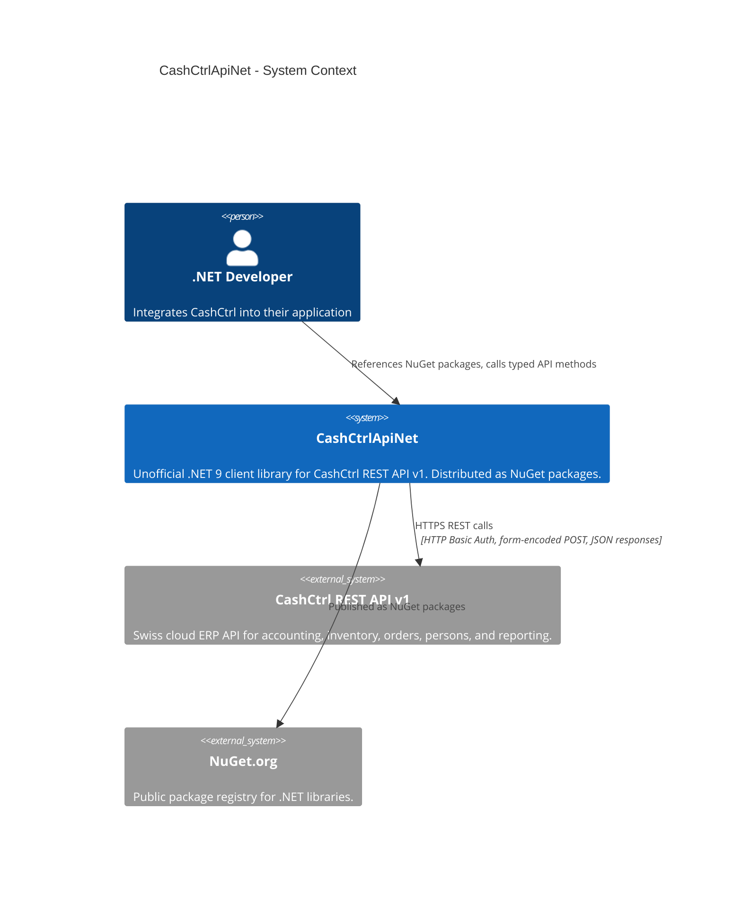

# System Context Diagram

## Actors

| Actor          | Type      | Description                                                              |
| -------------- | --------- | ------------------------------------------------------------------------ |
| .NET Developer | Person    | Consumes the NuGet packages to integrate CashCtrl into a .NET application |

## External Systems

| System              | Type     | Protocol       | Description                                                              |
| ------------------- | -------- | -------------- | ------------------------------------------------------------------------ |
| CashCtrl REST API   | External | HTTPS (REST)   | The upstream API this library wraps. Base URL: `https://{org}.cashctrl.com/api/v1/`. Authentication via HTTP Basic Auth with API key. |
| NuGet.org           | External | HTTPS          | Package distribution. Three packages are published: `CashCtrlApiNet`, `CashCtrlApiNet.Abstractions`, `CashCtrlApiNet.AspNetCore`. |

## Communication Patterns

- **Outbound HTTP only** -- The library is a client-side component. It makes outbound HTTPS requests to the CashCtrl API and returns typed results.
- **No inbound traffic** -- This is a library, not a service. It runs in the consumer's process.
- **Authentication** -- HTTP Basic Auth. The API key is passed as the username with an empty password, encoded as Base64 in the `Authorization` header.
- **Request format** -- GET requests use query parameters. POST requests use `application/x-www-form-urlencoded` body content.
- **Response format** -- JSON responses deserialized via `System.Text.Json` into typed record models.
- **Rate limiting** -- CashCtrl returns `X-CashCtrl-Requests-Left` header, tracked in `ApiResult.RequestsLeft`.
